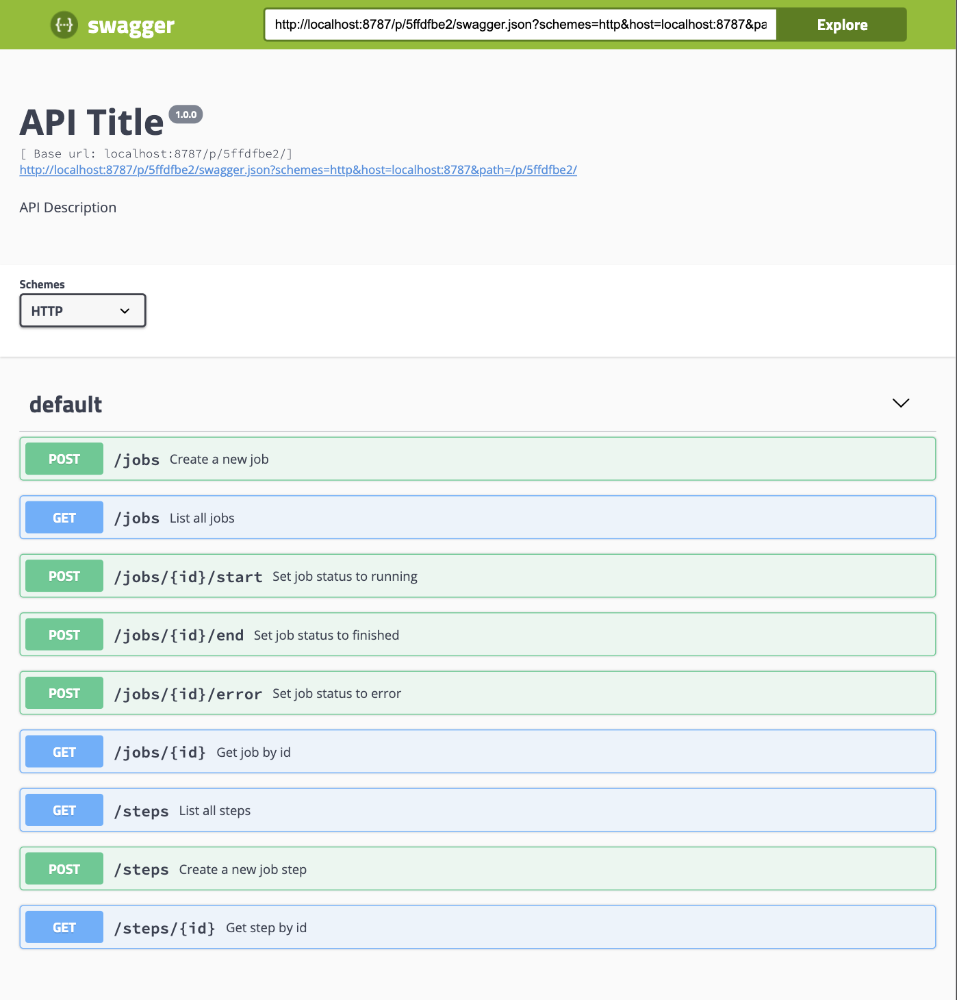

# monitauR-api

Example API for [monitauR](https://github.com/Wytamma/monitauR)

## Heroku deploy

```
heroku create --buildpack https://github.com/virtualstaticvoid/heroku-buildpack-r.git
```
```
heroku git:remote -a your-heroku-app-name
```
```
git push heroku master
```
```
heroku logs --tail
```
```
curl https://your-heroku-app-name.heroku.com/jobs
```
# Swagger


